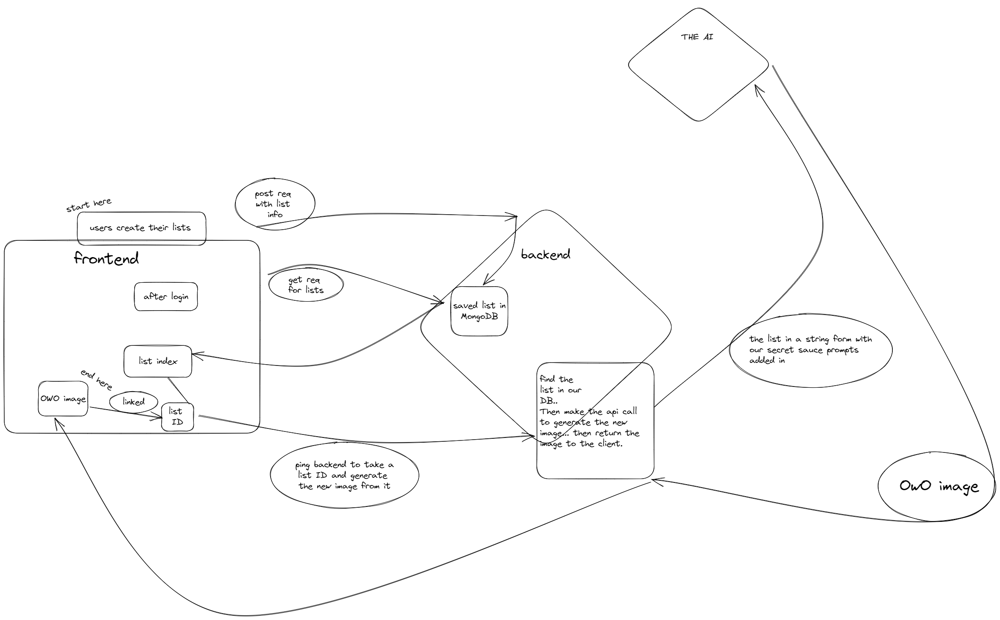

# What-AI-Want

What-Ai-Want is a web application that allows users to create their own avatar based on a selection of options. The application uses the OpenAI API to generate the avatar images and AWS S3 to store user-uploaded images.

# 

# [Wireframe](Assets/what_AI_want__2.pdf)

# Background and Overview

In a world where personal expression is highly valued, people are always looking for new ways to stand out and showcase their unique style. However, not everyone has the artistic talent or resources to create their own custom avatar. This is where What-Ai-Want comes in.

What-Ai-Want was created with the goal of providing a fun and accessible platform for anyone to create their own custom avatar, regardless of their artistic abilities. With a simple and intuitive user interface, users can select from a variety of options such as hair color, clothing, accessories, and background to create their perfect avatar.

Using the latest in image generation technology, the OpenAI API, What-Ai-Want is able to take these user preferences and generate a unique and personalized avatar in real-time. The avatars are not only customizable but also highly expressive and detailed, allowing users to truly showcase their individuality.

# Features

- User authentication with sign up and log in functionality.
- Ability to select different options for creating the avatar image, including hair color, clothing/accessory, gender, background, and art style.
- Uses the OpenAI API to generate avatar images based on the user's selected options.
- Allows users to upload their own images to use as a base for the avatar.
- Stores user-uploaded images in AWS S3.
- Displays the user's selected options and the generated avatar image on the profile page.

# Technologies Used

The application is built using the MERN stack along with other technologies, including:

- Node.js
- Express.js
- React.js
- Redux
- MongoDB
- Mongoose
- AWS S3
- OpenAI API
- JavaScript
- CSS
- HTML

# Technical Implementation Details & Challenges

## Technical Implementation Details

The user authentication system was implemented using Passport.js, which provides various authentication strategies like Local, JWT. We have implemented the Local authentication strategy using the passport-local package. The passwords are hashed and salted using the bcrypt package.

## Technical Challenges

- AWS Hosting and OpenAI api calls
- Optimizing Image Quality generation
- Moderation and Throttling
- Implementing MERN Stack

## Image Upload

We use AWS S3 to store user-uploaded images. When a user uploads an image, it is first stored on the server, then uploaded to AWS S3 using the aws-sdk package.

## OpenAI API

We use the OpenAI API to generate avatar images based on the user's selected options.

# Architecture

## Front-end:

The front-end of What-Ai-Want is built using React.js and Redux for state management. React is used to create a responsive and user-friendly interface, while Redux is used to manage the state of the application across different components.

To handle user input and display the options for avatar customization, we will use forms, dropdown menus, modal and other input elements from the React library. We will also use CSS for styling and layout.

## Back-end

The back-end of What-Ai-Want is built using Node.js with Express.js. This provides a flexible and robust platform for building RESTful APIs, handling HTTP requests, and managing middleware.

To store user data and preferences, we will use MongoDB with Mongoose, which provides a simple and efficient way to manage and interact with the database.

For image upload and storage, we will use AWS S3. This provides a scalable and secure way to store and retrieve images.

To generate the user's avatar based on their selected options, we will use the OpenAI API. The API provides a powerful and flexible platform for building natural language and image-based applications.

Overall, this separation of front-end and back-end technologies allows for a more modular and scalable architecture that can easily accommodate future updates and additions to the platform.

# Group Members & Work Breakdown

## Team

- Michael Shih : Project/Backend Lead
- Sara Ryu : Backend/Flex
- Kaiter Wu : Frontend Lead
- Timothy Dong : Frontend/Flex

## Work Breakdown

- Friday to Sunday 04/14/2023 - 4/16/2023

  - Writing Proposal README
  - Plan initial work for the week
  - Implement User Auth on database, backend, and frontend
  - Creating wireframe and diagram

- Monday 04/17/2023

  - Michael Shih - AWS setup and S3 image hosting
  - Sara Ryu - Fetching OpenAI api data
  - Kaiter Wu - Creating Splash Page and User Auth modals
  - Timothy Dong - Creating Splash Page, NavBar, and Carousel

- Tuesday 04/18/2023

  - Michael Shih - Setup Backend api routes and normalizing data-types. Wireframe revision.
  - Sara Ryu - Setup Backend routes for lists and pins
  - Kaiter Wu - Oraganize Redux State and beginning `Maike` page
  - Timothy Dong - Making Components dropdowns and buttons for `Maike` page

- Wednesday 04/19/2023

  - Michael Shih - Connecting Backend imageurls to `Splash` page
  - Sara Ryu - Connecting Backend imageurls to `Profile` page
  - Kaiter Wu - Finishing `Maike` page and Starting Profile page
  - Timothy Dong - Finishing `Maike` page and Finishing `Splash` page carousel

- Thursday 04/20/2023
  - Michael Shih - Details, Deployment, env files, About Page
  - Sara Ryu - About Page and assisting with styling
  - Kaiter Wu - Finishing `Profile` page and additional styling
  - Timothy Dong - Finishing `Profile` page and overall styling
