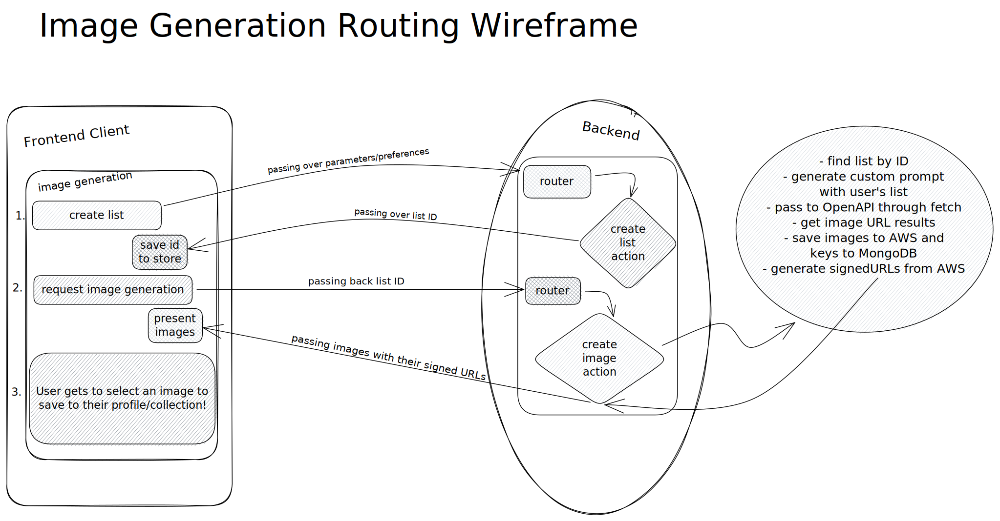
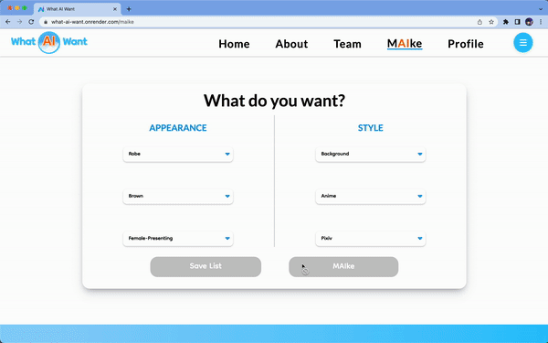

# What-AI-Want

What-Ai-Want is a web application that allows users to create their own avatar based on a selection of options. The application uses the OpenAI API to generate the avatar images and AWS S3 to store user-uploaded images.

#

# [Live Link](https://what-ai-want.onrender.com/)

# 

# [Wireframe](Assets/what_AI_want__2.pdf)

# Screenshot





# Background and Overview

In a world where personal expression is highly valued, people are always looking for new ways to stand out and showcase their unique style. However, not everyone has the artistic talent or resources to create their own custom avatar. This is where What-Ai-Want comes in.

What-Ai-Want was created with the goal of providing a fun and accessible platform for anyone to create their own custom avatar, regardless of their artistic abilities. With a simple and intuitive user interface, users can select from a variety of options such as hair color, clothing, accessories, and background to create their perfect avatar.

Using the latest in image generation technology, the OpenAI API, What-Ai-Want is able to take these user preferences and generate a unique and personalized avatar in real-time. The avatars are not only customizable but also highly expressive and detailed, allowing users to truly showcase their individuality.

# Features

- User authentication with sign up and log in functionality.
- Ability to select different options for creating the avatar image, including hair color, clothing/accessory, gender, background, and art style.
- Uses the OpenAI API to generate avatar images based on the user's selected options.
- Allows users to upload their own images to use as a base for the avatar.
- Stores user-uploaded images in AWS S3.
- Displays the user's selected options and the generated avatar image on the profile page.

# Technologies Used

The application is built using the MERN stack along with other technologies, including:

- Node.js
- Express.js
- React.js
- Redux
- MongoDB
- Mongoose
- AWS S3
- OpenAI API
- JavaScript
- CSS
- HTML

# Technical Implementation Details & Challenges

## Technical Challenges

- AWS Hosting and OpenAI api calls
- Optimizing Image Quality generation
- Moderation and Throttling
- Implementing MERN Stack

## Image Storage

We used AWS S3 to store our images. The image generation API returns a url with the image that is valid for only 10 minutes. Part of our challenge was to implement a backend lifecycle to take those urls and forward the image to AWS. 

To do this, we made our own custom AWS functions to interact with image binary large objects (blobs). 

```javascript
const uploadToAWSWithURL = async (url, title) => {
 
    const res = await fetch(url)
    const blob = await res.blob();
    const arrayBuffer = await blob.arrayBuffer();

    const buffer = Buffer.from(arrayBuffer)

    const key = singleFileUpload(buffer, title);

    return key
}
```

## OpenAI API

We use the OpenAI API to generate avatar images based on the user's selected options. 

[See OpenAI's image API](https://platform.openai.com/docs/guides/images/usage)

Inside the code below, some standout points are how we:

- implemented alternating different API keys using a simple `Math.random()` call 
- utilized `promise.all` to asynchronously map through our generated images and upload to AWS
- nested multiple objects in our return statement to communicate with the frontend 
- interpolated the list preferences into a specific AI prompt


```javascript
try {
    let list = await List.findOne({ _id: req.params.id });

    let prompt;

    if (list) {
      prompt = `Extremely Detailed Professional ${list.artStyle} of a ${list.gender} with ${list.hairColor} hair, wearing an ${list.clothingAccessory}, official media, trending on ${list.websiteStyle}, background ${list.background}`;


      const numberOfImages = 4;
      const imageSize = "1024x1024";
      const selector = Math.round(Math.random())
      ais[selector]
        .createImage({
          prompt: prompt,
          n: numberOfImages,
          size: imageSize,
        })
        .then(async (data) => {
          let imageKeys = [];

          imageKeys = await Promise.all(
            data.data.data.map(async (image, idx) => {
              const imageKeyPromise = uploadToAWSWithURL(
                image.url,
                `image${idx}.png`
              );
              const imageKey = await imageKeyPromise;
              return imageKey;
            })
          );

          let imageObjects = await Promise.all(imageKeys.map(async (key) => {
            let newImage = new Image({
              prompts: list,
              AWSKey: key
            })

            const image = await newImage.save();
            return image;
          }))

          let tempUrls = [];

          tempUrls = await Promise.all(
            imageKeys.map(async (key) => {
              const tempUrl = await getUrlFromAwsWithKey(key);
              return tempUrl;
            })
          );

          const returns = imageObjects.map((imageObj, idx) => {
            const resObj = {...imageObj.toObject(),
              tempUrl: tempUrls[idx]
            };
            return resObj
          })

          return res.json({
            list: list,
            images: returns,
          });
        });
    }
  } catch (err) {
    return res.json(err);
  }
```

# Architecture

## Front-end:

The front-end of What-Ai-Want is built using React.js and Redux for state management. React is used to create a responsive and user-friendly interface, while Redux is used to manage the state of the application across different components.

To handle user input and display the options for avatar customization, we will use forms, dropdown menus, modal and other input elements from the React library. We will also use CSS for styling and layout.

See our routing with React-Router-Dom v5.

One standout point was how we reused our `<MaikeForm>` component to work for creating and editing, saving a ton of codespace. Within our router, we passed a prop that would indicate what task to render. 

```javascript
<>
  <ScrollToTop />
  <NavIndex />
  <Switch>
    <Route exact path="/profile">
      <Profile />
      {redirect}
    </Route>

    <Route exact path="/maike">
      <MaikeForm type={"Create"} />
      {redirect}
    </Route>

    <Route exact path="/about">
      <FinalAbout/>
    </Route>

    <Route exact path="/team">
      <Team />
    </Route>
    
    <Route exact path="/edit/:listId">
      <MaikeForm type={"Edit"} />
    </Route>

    <Route path="/">
      <SplashExample />
    </Route>

  </Switch>

  <Footer />
</>


```

## Back-end

The back-end of What-Ai-Want is built using Node.js with Express.js. This provides a flexible and robust platform for building RESTful APIs, handling HTTP requests, and managing middleware.

To store user data and preferences, we will use MongoDB with Mongoose, which provides a simple and efficient way to manage and interact with the database.

For image upload and storage, we will use AWS S3. This provides a scalable and secure way to store and retrieve images.

To generate the user's avatar based on their selected options, we will use the OpenAI API. The API provides a powerful and flexible platform for building natural language and image-based applications.

Overall, this separation of front-end and back-end technologies allows for a more modular and scalable architecture that can easily accommodate future updates and additions to the platform.

# Group Members & Work Breakdown

## Team

- Michael Shih : Project Lead / GitHub Reviewer
- Sara Ryu : Backend Lead / Flex Designer
- Kaiter Wu : Frontend Lead / Full Stack Flex
- Timothy Dong : Frontend / CSS Detailer

## Work Breakdown

- Friday to Sunday 04/14/2023 - 4/16/2023

  - Writing Proposal README
  - Plan initial work for the week
  - Implement User Auth on database, backend, and frontend
  - Creating wireframe and diagram

- Monday 04/17/2023

  - Michael Shih - AWS setup and S3 image hosting
  - Sara Ryu - Fetching OpenAI api data
  - Kaiter Wu - Creating Splash Page and User Auth modals
  - Timothy Dong - Creating Splash Page, NavBar, and Carousel

- Tuesday 04/18/2023

  - Michael Shih - Setup Backend api routes and normalizing data-types. Wireframe revision.
  - Sara Ryu - Setup Backend routes for lists and pins
  - Kaiter Wu - Oraganize Redux State and beginning `Maike` page
  - Timothy Dong - Making Components dropdowns and buttons for `Maike` page

- Wednesday 04/19/2023

  - Michael Shih - Connecting Backend imageurls to `Splash` page
  - Sara Ryu - Connecting Backend imageurls to `Profile` page
  - Kaiter Wu - Finishing `Maike` page and Starting Profile page
  - Timothy Dong - Finishing `Maike` page and Finishing `Splash` page carousel

- Thursday 04/20/2023
  - Michael Shih - Details, Deployment, env files, About Page
  - Sara Ryu - About Page and assisting with styling
  - Kaiter Wu - Finishing `Profile` page and additional styling
  - Timothy Dong - Finishing `Profile` page and overall styling
